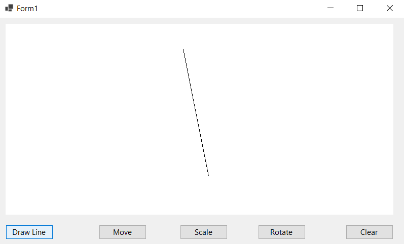

# DDA Line Drawing Algorithm – WinForms (C#)

This project demonstrates the **Digital Differential Analyzer (DDA) line drawing algorithm** using **C# Windows Forms**.  
The lines are drawn on a **Bitmap** canvas instead of direct `Graphics`, which improves performance and allows easy clearing.

---
- **MainForm**  


- **DrawLine**  


- **DeleteLine**  


- **Draw**  


- **Translate Line**  


- **Scale Line**  


- **Rotate Line**  


- **Clean**  


## 📌 Features
- Implements DDA Line Drawing Algorithm.
- Draws pixels on a Bitmap canvas.
- Draw + Clear buttons.
- Easy-to-understand structure:
  - `Program.cs`
  - `Form1.cs`
  - `Form1.Designer.cs`
  - `DDA.cs`

---

## 🧠 How DDA Works

1. Compute `dx = x2 - x1` and `dy = y2 - y1`.
2. Find number of steps = `max(|dx|, |dy|)`.
3. Calculate increments:
   - `xInc = dx / steps`
   - `yInc = dy / steps`
4. Start at `(x1, y1)`.
5. For each step:
   - Plot a pixel at `(x, y)`.
   - Add `xInc` and `yInc` to `x` and `y`.

---

## ▶ How to Run
1. Open the project in **Visual Studio**.
2. Press **F5** or **Start**.
3. Click **Draw Line** to draw a demo line.
4. Click **Clear** to erase the canvas.

---

## 📁 Project Structure
- `Program.cs`: The main entry point of the application.
- `Form1.cs`: Contains the main form logic, including drawing and clearing the canvas.
- `Form1.Designer.cs`: Auto-generated designer file for UI elements like buttons.
- `DDA.cs`: Contains the DDA (Digital Differential Analyzer) algorithm for line drawing.
- `README.md`: Documentation for setting up, running, and understanding the project.
- `bin/` & `obj/`: Auto-generated folders for compiled binaries and temporary files (do not commit to Git).
- `.gitignore`: Specifies files and directories to exclude from version control.

---
# 🎯 Bresenham’s Circle Drawing Algorithm (C# Implementation)

This project demonstrates how to draw a circle using **Bresenham’s Midpoint Circle Algorithm** in C#.  
The algorithm uses **integer arithmetic and 8-way symmetry** for fast and efficient rasterization of circles.

- **MainForm**  


---

## 📌 Overview

Bresenham’s circle algorithm avoids slow trigonometric calculations and instead uses a decision parameter to determine the next pixel.  
It calculates points in **one octant** and uses symmetry to draw the full circle.

This makes it very efficient and ideal for:

- Computer graphics  
- Game development  
- Low-power or embedded systems  
- Teaching fundamental graphics algorithms  

---

## 🧠 How the Algorithm Works

The algorithm uses the circle equation:

And draws only 1/8 of the circle, then mirrors it across axes:

- (+x, +y)
- (-x, +y)
- (+x, -y)
- (-x, -y)
- (+y, +x)
- (-y, +x)
- (+y, -x)
- (-y, -x)

This is the core idea of **8-way symmetry**.

---

## 🧩 Plotting Symmetric Points (Core Function)

```csharp
void PlotCirclePoints(Bitmap b, int x_centre, int y_centre, int x, int y)
{
    b.SetPixel(x + x_centre, y + y_centre, Color.Red);
    b.SetPixel(-x + x_centre, y + y_centre, Color.Red);
    b.SetPixel(x + x_centre, -y + y_centre, Color.Red);
    b.SetPixel(-x + x_centre, -y + y_centre, Color.Red);

    if (x != y)
    {
        b.SetPixel(y + x_centre, x + y_centre, Color.Red);
        b.SetPixel(-y + x_centre, x + y_centre, Color.Red);
        b.SetPixel(y + x_centre, -x + y_centre, Color.Red);
        b.SetPixel(-y + x_centre, -x + y_centre, Color.Red);
    }
}


